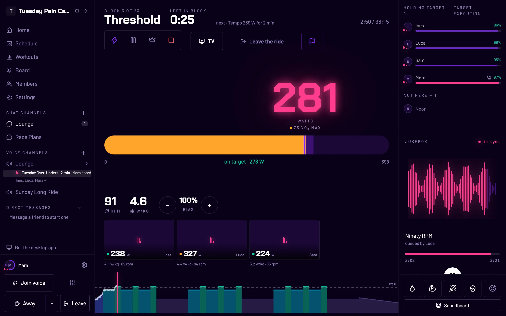
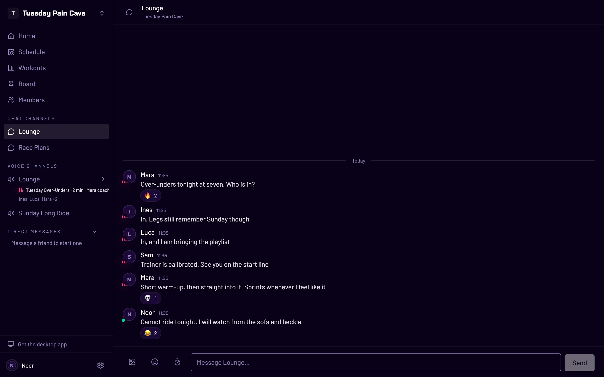
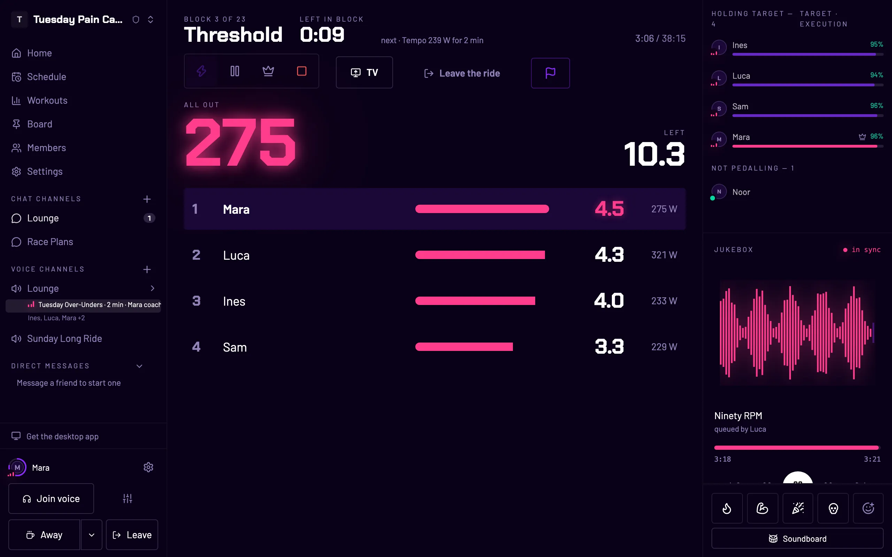
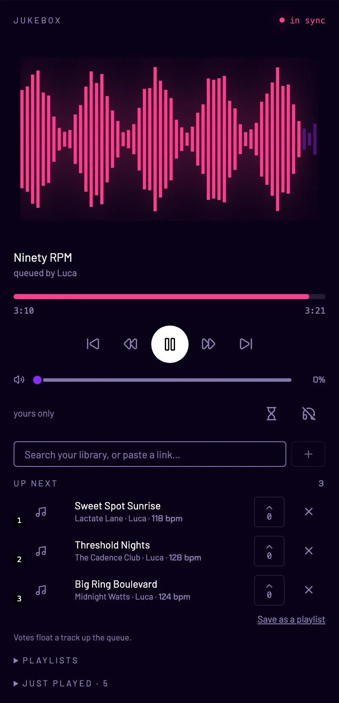
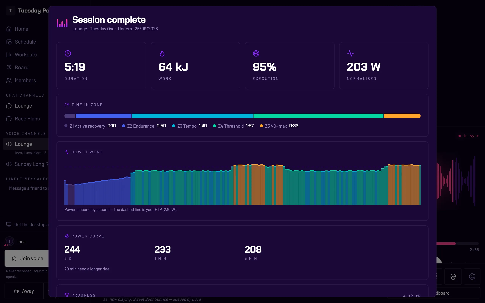
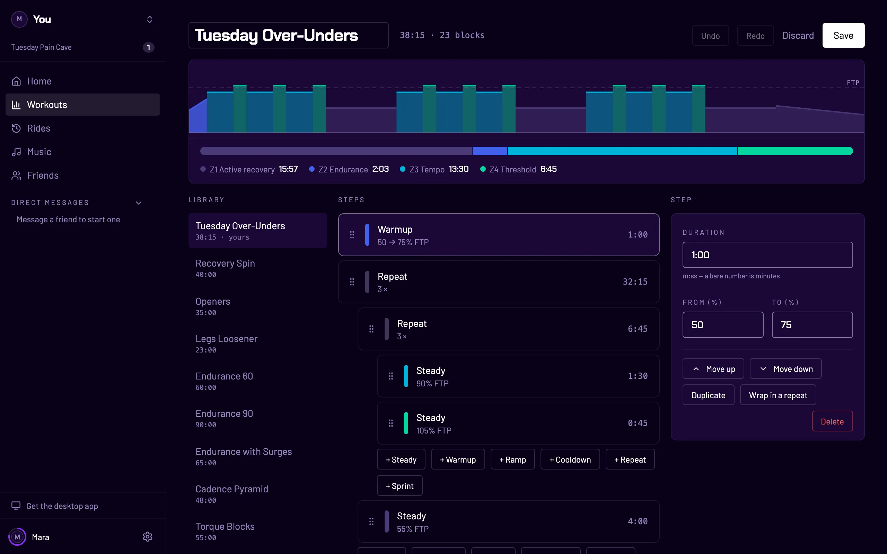
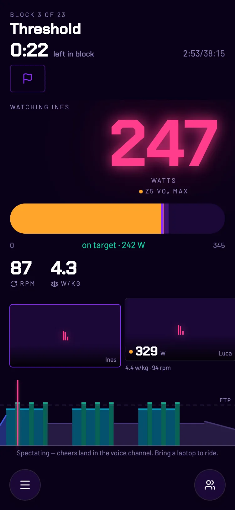
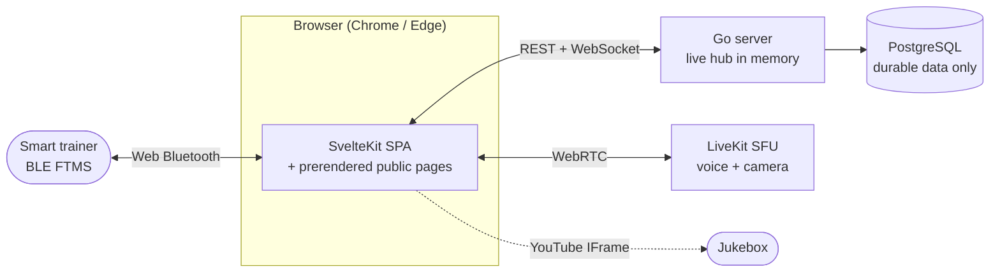

<div align="center">

<a href="https://wattroom.ch"></a>

# WattRoom

**Discord for indoor cycling.** Your crew rides one structured workout together,
every smart trainer on its own rider's FTP, with voice built in.
No virtual world: **your watts are the game.**

**[Ride now at wattroom.ch](https://wattroom.ch)** ·
[Desktop app](https://wattroom.ch/download) ·
[Game modes](https://wattroom.ch/game-modes) ·
[Self-host](https://wattroom.ch/self-host) ·
[Contribute](CONTRIBUTING.md)

[](https://github.com/natrontech/wattroom/releases)
[](https://github.com/natrontech/wattroom/actions/workflows/ci.yml)
[](LICENSE)
[](https://github.com/natrontech/wattroom/stargazers)

</div>



## Why

Indoor training is boring alone, and riding with friends usually means three
apps: a training app, Discord for voice, and something for music, all
fighting over one headset. Zwift answers boredom with a game world.
WattRoom answers it with **your crew**:

- **A place, not an event.** A crew has text channels for the week and voice
  channels for ride night, like a Discord server for your pain cave. Anyone
  in the voice channel starts a workout. There is no Meetup to set up first.
- **Different FTPs, one session.** Workouts are written in percentages of FTP,
  and every trainer holds its own rider's share in ERG mode. The 180 W rider
  and the 320 W rider ride the same intervals side by side, and it hurts both
  of them the same.
- **Talk the whole way.** Voice is one tap, the camera is optional, and the
  crew's music ducks when someone speaks.
- **Free, in the browser, open source.** Chrome or Edge talks to your trainer
  over Bluetooth. Nothing to install and nothing to pay.

## What's inside

<table>
<tr>
<td width="50%" valign="top">

**Crews with text and voice channels.** Invite by a six-character code.
Plan rides on a shared schedule, pin what you keep asking about, and
talk before, during and after.



</td>
<td width="50%" valign="top">

**Seven game modes**, decided by watts alone and measured on each rider's
own FTP, so the smallest engine in the crew can win.



</td>
</tr>
<tr>
<td width="50%" valign="top">

**A shared jukebox.** YouTube links, playlists and your own MP3s play in
sync for everyone in the voice channel. Vote tracks up.



</td>
<td width="50%" valign="top">

**Rides that count.** Power curve and zones, XP and trophies, a `.fit`
file and one tap to Strava. Private by default.



</td>
</tr>
<tr>
<td width="50%" valign="top">

**Workouts.** A curated library, an editor, and import for the `.zwo` and
`.erg` files you already have. A [free ramp test](https://wattroom.ch/ftp-test)
finds your FTP.



</td>
<td width="50%" valign="top">

**On the phone on your bars.** A phone follows the session, with everyone's
numbers, the chat and the voice channel, while the laptop runs the trainer.

<p align="center"></p>

</td>
</tr>
</table>

### The game modes

| Mode                | How it plays                                                          |
| ------------------- | --------------------------------------------------------------------- |
| **Sprint Roulette** | Five sprints land at random, a klaxon three seconds before each.       |
| **Points Race**     | Two-minute intervals with sprints hidden in them. Every one scores.  |
| **Watt Golf**       | Hit a wattage for ten seconds, with the meter turned off.             |
| **Backyard Ramp**   | Three-minute rounds, +5 % FTP each. Ten seconds below and you're out. |
| **Collective Ramp** | The same, on the crew's average. Nobody gets dropped alone.           |
| **Floor is Lava**   | A power zone is called. Leave it and you burn a life.                 |
| **Team Relay**      | One rider on the front at 110 %, everyone else recovering.            |

The parameters live in [docs/SPEC.md](docs/SPEC.md#game-mode-parameters-defaults--tune-in-alpha).
You can [try a sprint on the website](https://wattroom.ch/game-modes).

> [!NOTE]
> **Hardware and browsers.** WattRoom needs a smart trainer that speaks **Bluetooth FTMS**, which most current trainers do. Pre-FTMS Wahoo units are [not supported yet](https://github.com/natrontech/wattroom/issues/4). It also needs **Chrome or Edge** on Windows, macOS or Android, or the [desktop app](https://wattroom.ch/download). On Linux, Chrome keeps Web Bluetooth behind a flag. Safari and Firefox cannot reach a trainer, so iPhone and iPad riders can join the crew and the call but not ride. That is a [researched decision](docs/decisions/0004-chrome-first-with-native-escape-hatch.md), not an oversight.

## How it compares

|                             | WattRoom                  | Zwift               | TrainerRoad           | MyWhoosh      |
| --------------------------- | ------------------------- | ------------------- | --------------------- | ------------- |
| Price                       | Free                      | US$19.99/mo         | US$21.99/mo per rider | Free          |
| One workout, each on own FTP | ✓ anyone in the channel starts it | ✓ via a Meetup | ✓ up to 11 riders | pacer-led group workouts |
| Voice built in              | ✓                         | text chat           | ✓ voice and video     | text chat     |
| Virtual world               | none, on purpose          | ✓                   | none                  | ✓             |
| Runs in a browser           | ✓                         | –                   | –                     | –             |
| Open source                 | ✓ AGPL                    | –                   | –                     | –             |

Checked September 2026. There are sources and a "pick them if…" for each on [wattroom.ch/zwift-alternative](https://wattroom.ch/zwift-alternative). We make WattRoom, so check for yourself.

## Run it

- **Hosted, free:** [wattroom.ch](https://wattroom.ch). Start a crew and send the code.
- **Desktop app** for macOS, Windows and Linux: [wattroom.ch/download](https://wattroom.ch/download).
- **Your own server:** one Go binary with the web app embedded, Postgres and
  LiveKit, all in one Docker Compose stack on a small VM.

<details>
<summary><b>Self-host in five minutes</b></summary>

```sh
mkdir -p /opt/wattroom && cd /opt/wattroom
# copy this repository's deploy/ directory here
cp .env.example .env                    # every value is explained inside
cp livekit.yaml.example livekit.yaml    # same keys as .env
docker compose -f docker-compose.prod.yml up -d
```

Releases are CalVer tags (`ghcr.io/natrontech/wattroom:2026.09.1`). An update
is a tag bump, and a rollback is the previous tag: migrations only ever add
([ADR-0019](docs/decisions/0019-tagged-releases-and-a-self-converging-vm.md)).
The full guide, including how LiveKit reaches the server and what to back up,
is in [deploy/README.md](deploy/README.md).

</details>

## Develop

Requirements: Go 1.26+, Node 22+, pnpm, Docker. The pnpm version is pinned in
`web/package.json` (`packageManager`), and pnpm 10+ or corepack installs it for you.

```sh
make infra        # Postgres + LiveKit (dev mode) in containers
make dev-server   # terminal 1: Go server with hot reload on :8080
make dev-web      # terminal 2: Vite dev server on :5174 (proxies /api + /ws)
```

No smart trainer needed: the simulated trainer covers development, and
`/dev/channel` is a full mock voice channel. `make screenshots` redraws every
image in this README and on the website from the running dev pair. Start with
[CONTRIBUTING.md](CONTRIBUTING.md); every product and architecture decision is
in [WATTROOM.md](WATTROOM.md) and [docs/decisions/](docs/decisions/).



The seams are deliberate. The browser owns the trainer, the server owns live
state in memory, and Postgres owns only what has to last
([docs/ARCHITECTURE.md](docs/ARCHITECTURE.md)). WattRoom ships several times a
day: a release only ever adds a small, merged change, and rolling back means
repointing the image at the previous tag.

## License

[AGPL-3.0](LICENSE), © [Natron](https://natron.io), built in Switzerland. If WattRoom
made a Tuesday night better, [star the repo](https://github.com/natrontech/wattroom/stargazers).
It helps other pain-cave dwellers find it.
