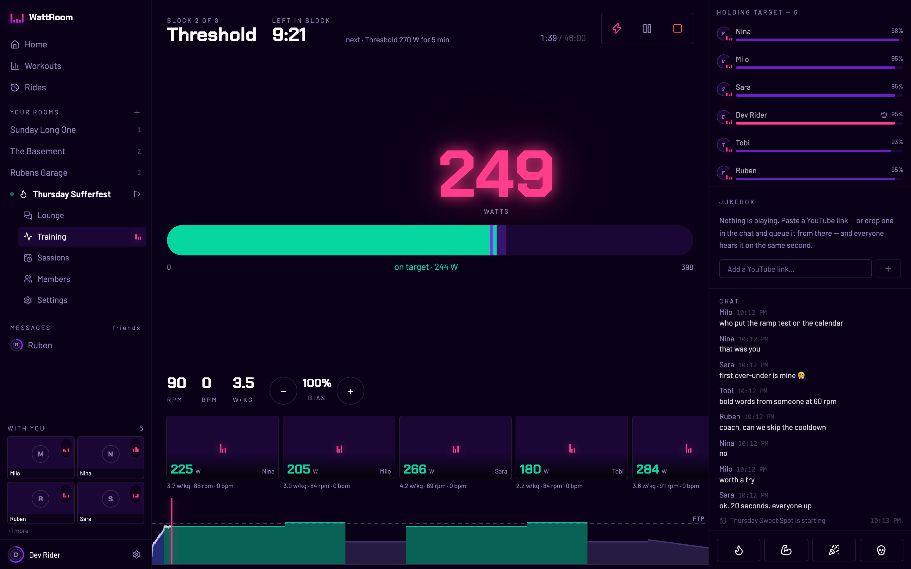
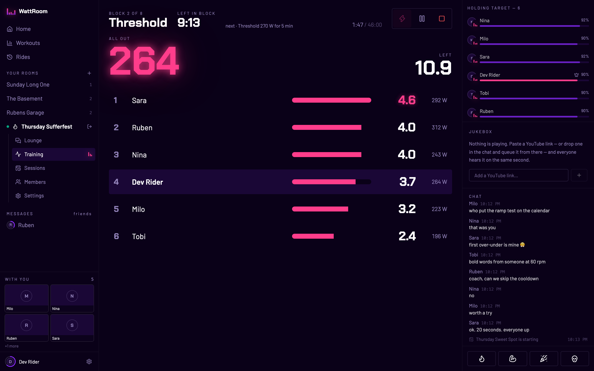
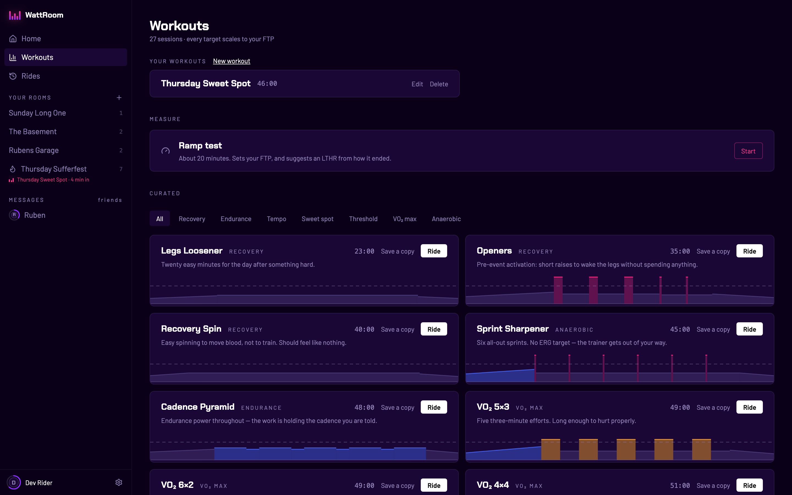
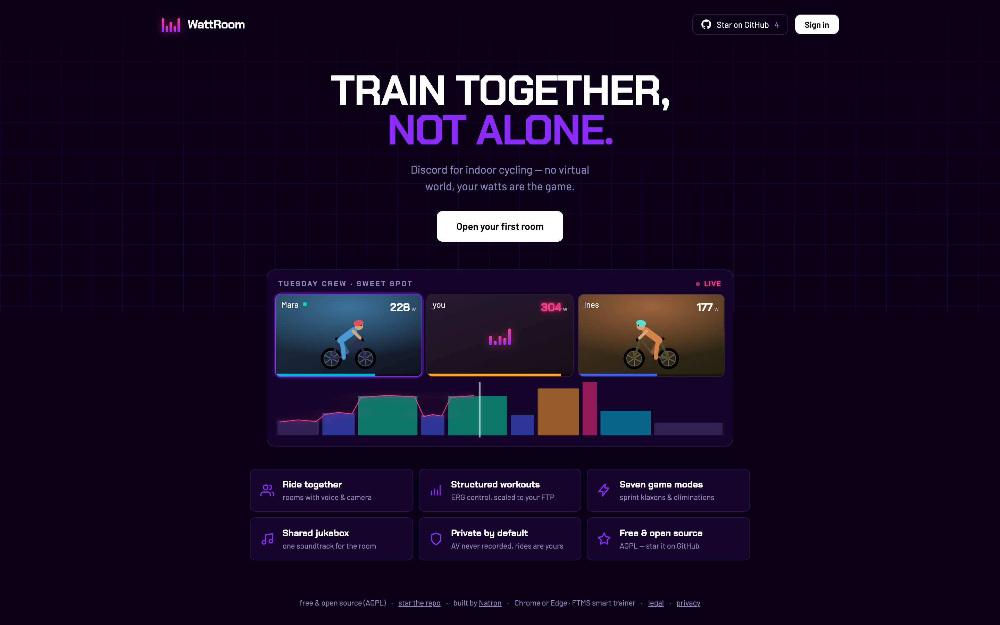
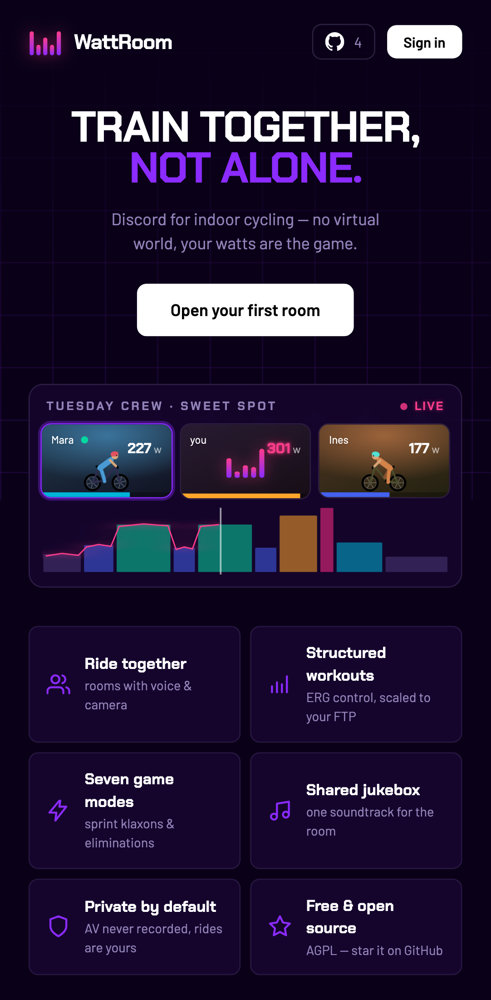

<div align="center">

# WattRoom

**Train together, not alone.**

Discord for indoor cycling — structured workouts your whole crew rides at once,
with voice, camera, game modes and a shared jukebox.
No virtual world: **your watts are the game.**

[](LICENSE)
[](server/)
[](web/)
[](docs/ARCHITECTURE.md)

[Architecture](docs/ARCHITECTURE.md) · [Spec](docs/SPEC.md) ·
[Founding doc](WATTROOM.md) · [Contributing](CONTRIBUTING.md) ·
built by [Natron](https://natron.io)

⭐ **Like the idea? [Star the repo](https://github.com/natrontech/wattroom/stargazers)** — it helps other pain-cave dwellers find it.



<sub>Six riders, one timeline. Every target scales to the rider's own FTP, so the crew rides together whatever their numbers are.</sub>

</div>

## Why

Indoor training is boring alone. Zwift fixes that with a game world; WattRoom
fixes it with **presence** — you hop into a room with your training buddies,
everyone rides the same workout scaled to their own FTP, you talk, you see each
other, you share music. A group ride for pain caves.

## What's inside

|                                                                                            |                                                                                          |
| ------------------------------------------------------------------------------------------ | ---------------------------------------------------------------------------------------- |
| 🚴 **Rooms** — live watts, HR and cadence on one dashboard, voice & camera one tap away    | 📈 **Structured workouts** — curated library + editor, precise ERG control over BLE FTMS |
| 🎮 **Seven game modes** — sprint klaxons, eliminations, Watt Golf, Backyard Ramp, …        | 🎵 **Shared jukebox** — one synced YouTube soundtrack per room                           |
| 🏅 **Rides that count** — every session saved, `.fit` export, Strava upload, XP & trophies | 🔒 **Private by default** — metrics room-scoped, AV never recorded                       |

## Screens

|                                   The sprint moment                                    |                                        The workout library                                        |
| :------------------------------------------------------------------------------------: | :-----------------------------------------------------------------------------------------------: |
|  |  |

The way in — on a desk, and on the phone that lives on the bars:

<p align="center">
  
  
</p>

## Quick start (dev)

Requirements: Go 1.26+, Node 22+, pnpm, Docker.

```sh
make infra        # Postgres + LiveKit (dev mode) in containers
make dev-server   # terminal 1: Go server with hot reload on :8080
make dev-web      # terminal 2: Vite dev server on :5174 (proxies /api + /ws)
```

No smart trainer needed — the simulated trainer covers development, and
`/dev/room` is a full mock room. See [CONTRIBUTING.md](CONTRIBUTING.md).

## Hardware & browsers

A smart trainer speaking **BLE FTMS** (pre-FTMS Wahoo units are backlog, #4), talked to directly
from the browser via Web Bluetooth — which is Chromium-only: **Chrome/Edge on
desktop and Android**. No iOS path (Safari won't implement Web Bluetooth — a
[researched decision](docs/decisions/0004-chrome-first-with-native-escape-hatch.md),
not an oversight); the room itself opens in any browser, with the
affordances that need a trainer gated off rather than a separate read-only
page.

## Stack

Go server (in-memory room hub, one goroutine per room) · SvelteKit SPA ·
PostgreSQL · self-hosted LiveKit · single binary with embedded frontend,
deployed as one compose stack on a single VM. Every product and architecture
decision is recorded in [WATTROOM.md](WATTROOM.md) and
[docs/decisions/](docs/decisions/); the research behind them in
[docs/RESEARCH.md](docs/RESEARCH.md).

## License

[AGPL-3.0](LICENSE) — © [Natron](https://natron.io)
